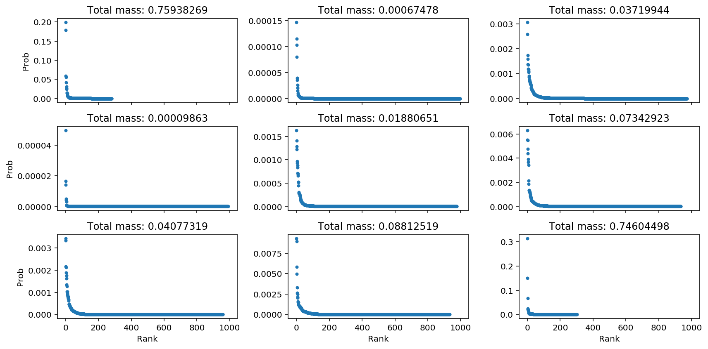
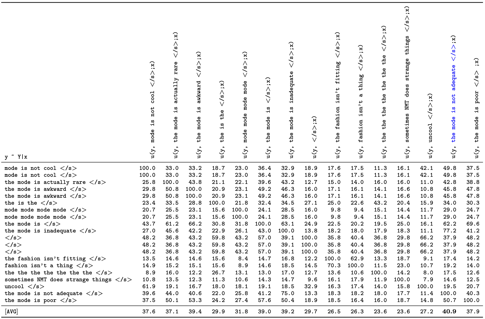
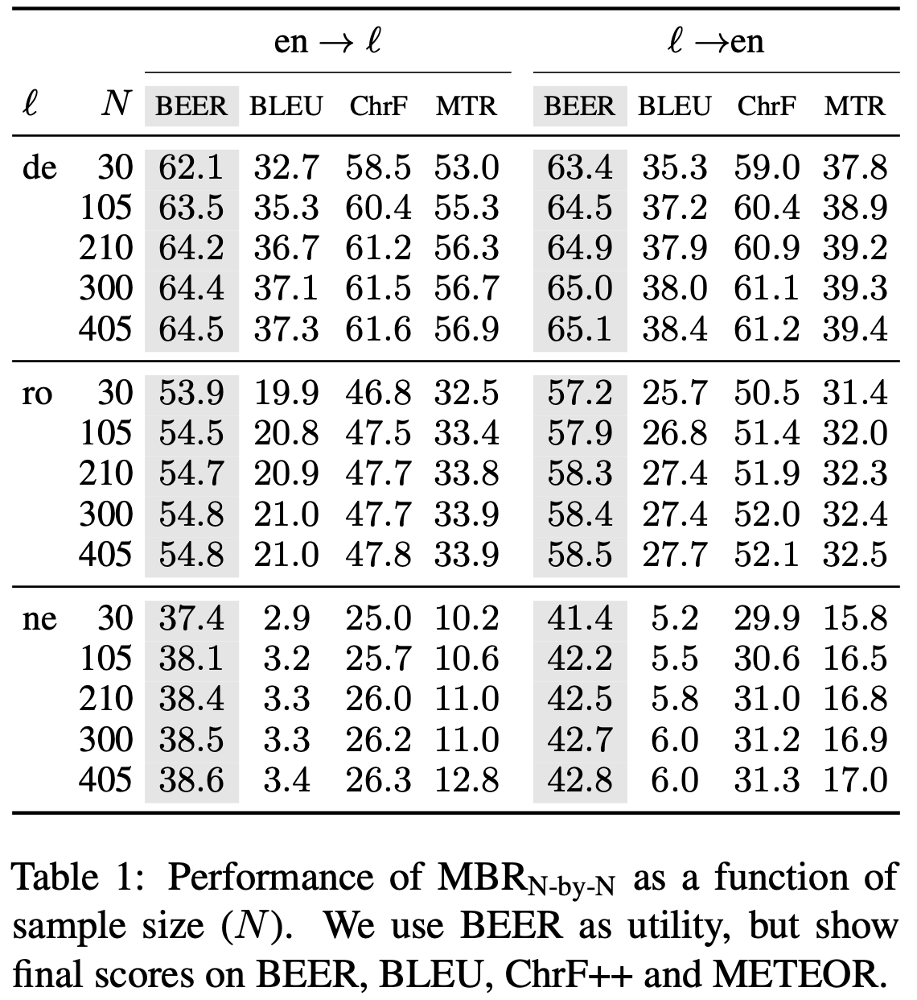
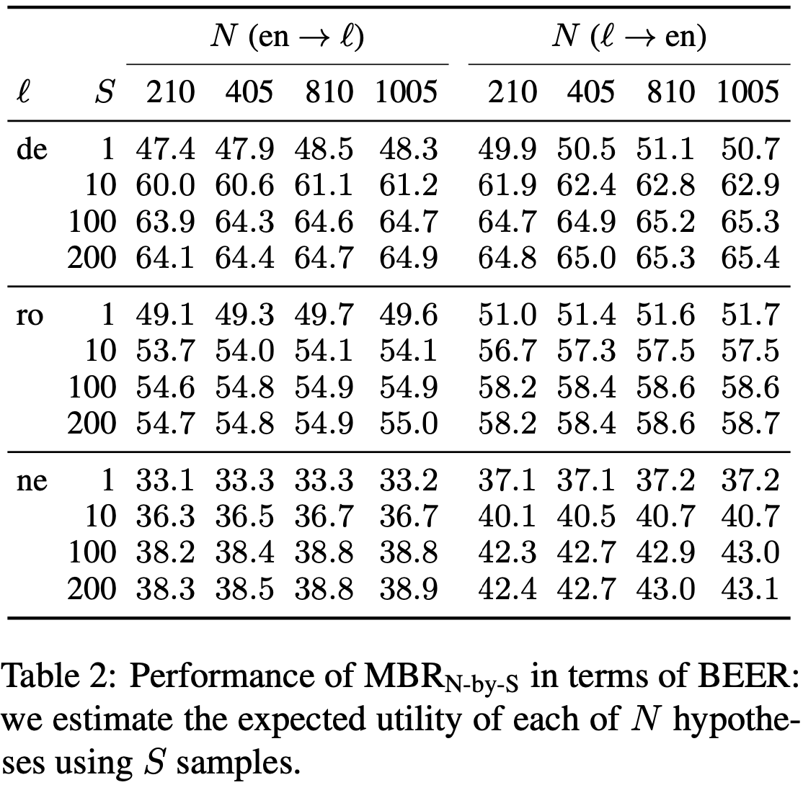
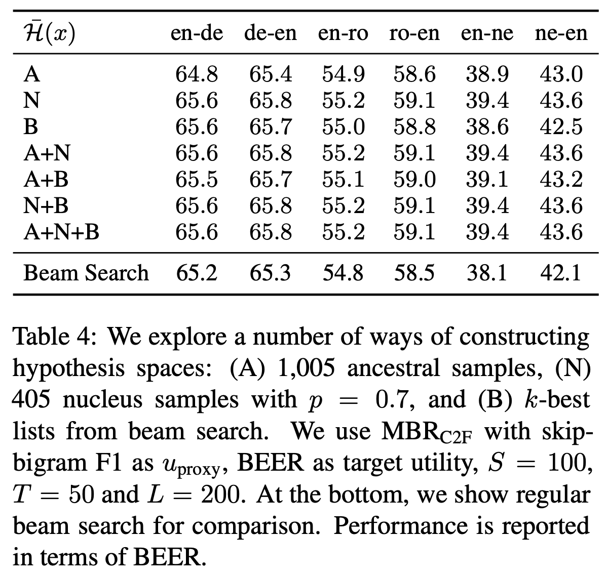
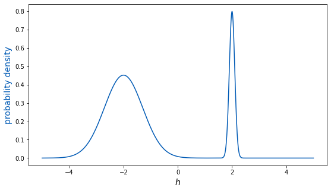
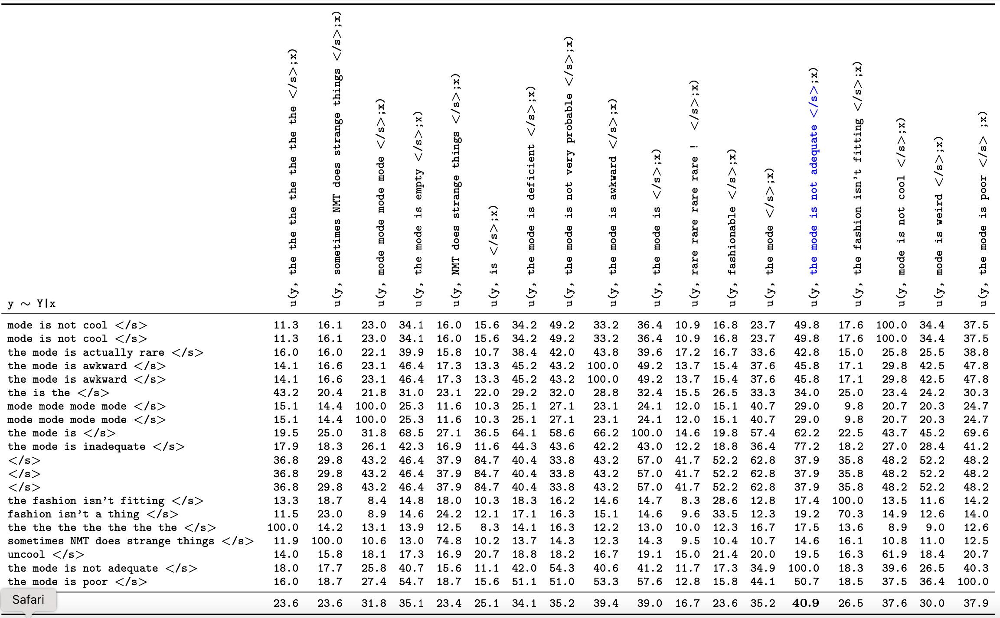

<!-- _header: '' -->
<!-- _paginate: false -->
<!-- _footer: 'Check the [pre-print on arXiv](https://arxiv.org/pdf/2108.04718.pdf) and a demo on [github](https://github.com/probabll/demo-mbr-nmt) or [Colab](https://colab.research.google.com/github/probabll/demo-mbr-nmt/blob/main/German-English.ipynb).' -->

# Sampling-Based Minimum Bayes Risk Decoding for Neural Machine Translation


 Bryan Eikema and Wilker Aziz


---

<!-- _footer: For NMT, any sequence $y$ made of known target-language tokens and ending in a special end-of-sequence symbol is a valid translation candidate. -->

<!-- accessible blue and red: #005AB5 #DC3220  
<span style='color: #005AB5'>blue</span>
<span style='color: #DC3220'>red</span>
-->

# Neural Machine Translation


We give an NMT model some source-language text $x$, and it predicts the probability that any target-language text $y$ is a translation of $x$.

<div data-marpit-fragment>

Another way of saying this is: <span style='text-align: center; color: #005AB5'>given a source sentence, NMT predicts a probability distribution over translation candidates</span>.

</div>

---

# Distribution over Translation Candidates

<!-- _footer: The bar plot contains infinitely many bars, NMT offers a tractable API to interact with it: assess the probability of an outcome (useful for training), draw a random outcome (useful for exploration), enumerate outcomes (useful for search). -->

You can imagine such an object as a *bar plot*: 


<style>
img {
  display: block;
  margin: 0 auto;
}
</style>


<span style="float:right; color: gray; font-size: smaller">Most probable candidates and their probabilities</span>


---

# Deciding under Uncertainty


We tend to think of NMT models as predicting **the correct translation** of $x$, but, as far as the model is concerned, there is no such a thing as a *single correct translation*.


<div data-marpit-fragment>

NMT packs its knowledge in an entire distribution over candidates. To pick a translation, **we** (*not the model*) decide to place all of ours bets on a single outcome (e.g., the mode).

</div>

* To decide under uncertainty, we need a criterion (i.e., a *decision rule*).
* An NMT model is not a decision rule, it cannot tell you how to decide.
* But we can use the uncertainty NMT quantifies to make an informed decision.

---

<!-- _footer: MAP decoding is a misnomer in NMT's context for NMT does not employ a prior over translations and, thus, does not require posterior inference.-->

# MAP Decoding
 
The most common decision rule in NMT is known as *maximum-a-posteriori (MAP) decoding*. It tells us to pick the mode of the distribution, no matter how improbable it is.


* MAP decoding: `</s>`


---

<!-- _footer: "In [Eikema and Aziz (2020)](https://www.aclweb.org/anthology/2020.coling-main.398/) we connected MAP decoding and the inadequacy of the mode to a number of pathologies of NMT." -->

# Inadequacy of the Mode 

The *mode* of the distribution is the single most probable outcome. Yet, in a large enough sample space, the mode may be extremely rare.  


* Modes in NMT are oftentimes as rare as 1 in millions.
* NMT models store statistics/patterns they learn from training data in the distributions they predict, not in any one specific outome.
* The mode can only be a good summary of an entire distribution, when an NMT model has no reason to be uncertain.
  * Uncertainty is unavoidable: ambiguity in natural language, lack of context, change in domain, lack of training data, etc.


---

<!-- _header: First few sentences in newstest2016 (ro-en) -->



---

# Quiz

Let's analyse this example for a bit longer:


* What is the probability that a translation should be non-empty?
* What is the probability that a translation should contain the word `mode`?

---


# Beliefs
 
While no single outcome is more probable than the mode, there are many *patterns* that are far more probable than the mode. 


<div data-marpit-fragment>

It's fair to claim that the model does not really want an empty translation, that `mode` is preferred to `fashion`, that we need an adjective, etc.

</div>


---

# A Model as a Representation of What's Known
 
If you had to decide between `</s>` and `the mode isn't adequate </s>`, and all you knew about language and translation is what an NMT model tells you:


<div data-marpit-fragment>

What would you pick and why?

</div>

---

# Utility

If we interpret translation candidates as atomic and unrelated outcomes, all NMT does is to express a preference over complete translations. This preference  is oftentimes very weak.

<div data-marpit-fragment>

Interpreted as combinatorial structures, we can appreciate structural similarity (e.g., some translations are equally long, make similar word choices, use similar word order).

</div>

<div data-marpit-fragment>

A **utility function** quantifies this similarity in a way that matters for a decision maker. 

</div>

* We say that $u(y, h; x)$ quantifies the *benefit* in choosing $h$ as the translation of $x$ when $y$ is known to be a plausible translation of it. 
* Examples: ChrF, BEER, METEOR, COMET, human judgment, etc.

---

# Uncertainty About Utility

When deciding whether or not $h$ is a reasonable translation of $x$, we do not have access to translations we already know to be reasonable choices. 

<div data-marpit-fragment>

But we have NMT models that give an approximate view of what good choices look like. 

</div>


---

# Expected Utility


If all I know is that $y$ translates $x$ with probability $p(y|x, \theta)$, then my expectation on 
$h$'s utility is the weighted average utility against every valid translation under the model:

<div data-marpit-fragment>

In technical terms we have,

$\overbrace{\mu_u(h; x, \theta)}^{\textcolor{gray}{\text{expected utility of }h}}=\, p(y^{(1)}|x, \theta) \overbrace{u(y^{(1)}, h; x)}^{\textcolor{gray}{\text{utility wrt }y^{(1)}}} + p(y^{(2)}|x, \theta) \overbrace{u(y^{(2)}, h; x)}^{\textcolor{gray}{\text{utility wrt }y^{(2)}}}+\cdots$ 
</div>

<div data-marpit-fragment>

$\,\,\qquad\qquad\qquad= \sum_{\textcolor{#DC3220}{y \in \mathcal Y}} \textcolor{#005AB5}{p(y|x, \theta)}u(y, h; x) \qquad \small{\textcolor{gray}{\text{also denoted by }\mathbb E[ u(Y, h; x) | \theta]}}$

where, in turn and with <text style="color:#005AB5;">some probability</span>, <span style="color:#DC3220;">each and every possible translation</span> <span style="color: black">is assumed to be a reference translation.</span>

</div>


---


# Example

Let's judge two candidates: `</s>` and `the mode isn't adequate </s>`.

For utility, we will use ChrF, which values candidates that match  character $n$-grams of a good translation.

---

```
h                             y                                 p(y|x)    u(y, h;x)    p(y|x) * u(y, h;x)
----------------------------  ------------------------------  --------  -----------  --------------------
</s>                          </s>                              0.0645       100.00                  6.45
                              the mode </s>                     0.0605        29.71                  1.80
                              the mode is </s>                  0.0477        24.93                  1.19
                              the mode is inadequate </s>       0.0469        13.84                  0.65
                              the mode is not adequate </s>     0.0441        13.25                  0.58
                              the mode is awkward </s>          0.0412        15.97                  0.66
                              the mode is empty </s>            0.0397        17.79                  0.71
                              the mode is deficient </s>        0.0390        14.48                  0.56
                              the mode is poor </s>             0.0359        18.87                  0.68
                              the fashion isn't fitting </s>    0.0342        12.21                  0.42
                              [...]
                              [SUM]                                                                 25.92

the mode isn't adequate </s>  </s>                              0.0645        37.93                  2.45
                              the mode </s>                     0.0605        58.62                  3.55
                              the mode is </s>                  0.0477        62.16                  2.96
                              the mode is inadequate </s>       0.0469        77.17                  3.62
                              the mode is not adequate </s>     0.0441        82.98                  3.66
                              the mode is awkward </s>          0.0412        45.80                  1.89
                              the mode is empty </s>            0.0397        49.20                  1.96
                              the mode is deficient </s>        0.0390        44.47                  1.73
                              the mode is poor </s>             0.0359        49.81                  1.79
                              the fashion isn't fitting </s>    0.0342        23.08                  0.79
                              [...]
                              [SUM]                                                                 40.87
```


---

<!-- _footer: "In NLP: [Goodman (1996)](https://aclanthology.org/P96-1024/), [Goel and Byrne (2000)](https://www.sciencedirect.com/science/article/abs/pii/S0885230800901384?via%3Dihub), [Kumar and Byrne (2002)](https://aclanthology.org/W02-1019/), [Sima'an (2003)](https://aclanthology.org/W03-3021/), [Kumar and Byrne (2004)](https://aclanthology.org/N04-1022/). </br> For *a lot* more, see [Eikema and Aziz (2021; section 6).](https://arxiv.org/pdf/2108.04718.pdf)" -->

# Minimum Bayes Risk Decoding

MBR decoding tells us to choose the candidate whose expected utility is maximum:
$$
\begin{aligned}
y^\star &= \operatorname*{argmax}_{h \in \mathcal Y} ~ \mathbb E\left[u(Y, h; x) \mid \theta \right]
\end{aligned}
$$

* Decision maker: chooses the utility function $u$
* NMT model: contributes beliefs (i.e., the probability of $y$ given $x$ for every possible $y$)
* Search algorithm: enumerates candidate translations $h \in \mathcal Y$, assesses their expected utility, and picks the best


---

# An *Origin Story*

<!-- _footer:  'This result is known in MT literature since at least [Kumar and Byrne (2004)](https://aclanthology.org/N04-1022)' -->

Consider the *exact match* utility $1_y(h)$ which is 1 when $y$ and $h$ are the same and 0 otherwise. Let's compute its expected value under the model:

$\mathbb E\left[ 1_Y(h) \right]$

<div data-marpit-fragment>


$=\sum_{y \in \mathcal Y} p_{Y|X}(y|x, \theta) 1_y(h)$

</div>

<div data-marpit-fragment>

$=\textcolor{#005AB5}{p_{Y|X}(h|x, \theta) \times 1} + \textcolor{#DC3221}{\sum_{y \in \mathcal Y \setminus \{h\}} p_{Y|X}(y|x, \theta) \times 0} = p_{Y|X}(h|x, \theta)$

</div>


<div data-marpit-fragment>

What do we get if we solve $~ \operatorname*{argmax}_{{h \in \mathcal Y}} ~ p_{Y|X}(h|x, \theta)$?

</div>


<div data-marpit-fragment>

*When we decide via MAP decoding, we implicitly decide via MBR using a utility function that treats translations as atomic categories.*

</div>


---


# Intractabilities of MBR decoding

There are **two sources** of intractability in MBR decoding
$$
\begin{aligned}
y^\star &= \operatorname*{argmax}_{\textcolor{#DC3220}{h \in \mathcal Y}} ~ \textcolor{#DC3220}{\mathbb{E}[}u(\textcolor{#DC3220}{Y}, h; x) \mid \theta \textcolor{#DC3220}{]}
\end{aligned}
$$

* The objective function (expected utility) requires an intractable sum
<span style="color: gray;">this is different from MAP decoding, where the objective is tractable</span>
* The hypothesis space $\mathcal Y$ is unbounded 
  <span style="color: gray;">just like in MAP decoding</span>


---


# Summarising the Model's Beliefs

<!-- _footer: "The word *sample* here has a technical meaning which is **not** satisfied by beam-search outputs, nucleus samples or top-k samples. In fact, this was not used in MT until [Eikema and Aziz (2020)](https://www.aclweb.org/anthology/2020.coling-main.398/). " -->

The space of *all* translation candidates is unbounded, making it impossible for us to exactly compute the expected utility of any given candidate.

But, expectations can be estimated in a principled manner via *Monte Carlo*.

<div data-marpit-fragment>

We use the **sample mean**
$$\hat \mu_u(h; x, \theta) = \frac{1}{S} \sum_{s=1}^S u(y^{(s)}, h; x)$$
where $y^{(s)}$ is sampled from the model with probability $p(y^{(s)}|x, \theta)$.

</div>

---

# What's a Sample?

<!-- _footer: 'As NMT factorises probability as a product of conditionals, *ancestral sampling* (Robert and Casella, 2004) draws a sample of length $n$ in time $\mathcal O(n)$' -->

Think of the NMT model as a bag of tokens, each token is a translation, if you put your hand in it and get a token, there's a probability $p(y|x,\theta)$ that you will get $y$.

* Drawing samples like that is easy in NMT because of the way the model decomposes the probability of a complete sequence as a product of probabilities, one for each target word in context from left-to-right.


<div data-marpit-fragment>

$$Y_j | \theta, x, y_{<j} \sim \mathrm{Cat}(f(x, y_{<j}; \theta))$$

</div>


---

# Example

Let's judge two candidates: `</s>` and `the mode isn't adequate </s>`.

We will **estimate** each candidate's expected utility using 20 samples from the model. 

For utility, we will use ChrF.

---

<!-- _header: '' -->
<!-- _paginate: false -->
<!-- _footer:  '' -->

## Monte Carlo Estimation of Expected Utility (I)

```
h                             y ~ Y|x                                   u(y, h;x)
----------------------------  --------------------------------------  -----------
</s>                          the mode is awkward </s>                      15.97
                              the mode is not very probable </s>            11.33
                              the fashion isn't fitting </s>                12.21
                              the mode is </s>                              24.93
                              mode is weird </s>                            21.48
                              is </s>                                       58.01
                              the mode is empty </s>                        17.79
                              the mode is not adequate </s>                 13.25
                              the mode is poor </s>                         18.87
                              NMT does strange things </s>                  13.25
                              rare rare rare rare ! </s>                    15.19
                              sometimes NMT does strange things </s>         9.59
                              mode mode mode mode </s>                      15.97
                              fashionable </s>                              21.48
                              the mode is deficient </s>                    14.48
                              the mode </s>                                 29.71
                              the the the the the the the </s>              12.71
                              mode is not cool </s>                         18.87
                              the mode is deficient </s>                    14.48
                              the mode is not adequate </s>                 13.25
                              [AVG]                                         18.64
```


---


<!-- _header: '' -->
<!-- _paginate: false -->
<!-- _footer:  '' -->

## Monte Carlo Estimation of Expected Utility (II)

```
h                             y ~ Y|x                                   u(y, h;x)
----------------------------  --------------------------------------  -----------
the mode isn't adequate </s>  the mode is poor </s>                         49.81
                              modes aren't adequate </s>                    69.07
                              the mode is awkward </s>                      45.80
                              the mode is awkward </s>                      45.80
                              fashion isn't a thing </s>                    29.31
                              cool </s>                                     18.05
                              unfashionable </s>                            21.98
                              the mode is awkward </s>                      45.80
                              the mode is awkward </s>                      45.80
                              fashion isn't a thing </s>                    29.31
                              the mode is inadequate </s>                   77.17
                              the mode is inadequate </s>                   77.17
                              the is the </s>                               33.96
                              the mode </s>                                 58.62
                              the mode is a mode </s>                       55.00
                              the mode is deficient </s>                    44.47
                              the mode is actually rare </s>                42.80
                              aren't adequate </s>                          75.46
                              the mode is not very probable </s>            41.56
                              the mode is not very probable </s>            41.56
                              [AVG]                                         47.42
```

---


# Revisiting Intractabilities of MBR Decoding 

There are **two sources** of intractability in MBR decoding
$$
\begin{aligned}
y^\star &= \operatorname*{argmax}_{\textcolor{#DC3220}{h \in \mathcal Y}} ~ \textcolor{#DC3220}{\mathbb{E}[}u(\textcolor{#DC3220}{Y}, h; x) \mid \theta \textcolor{#DC3220}{]}
\end{aligned}
$$

* The ~~objective function (expected utility) requires an intractable sum~~
<span style="color: #005AB5;">but unbiased estimation is tractable via MC</span>
* The hypothesis space $\mathcal Y$ is unbounded 
  <span style="color: #005AB5;">but, like in MAP decoding, we can use a small subset</span>

---

# Hypothesis Space

Ideally, we want to search through a small space of hypotheses which mostly contains candidates that are highly beneficial in expectation.

* This sort of **approximately best-first** enumeration is what beam search does for MAP decoding.
* A candidate's expected utility cannot be computed incrementally from left-to-right, thus approximate best-first enumeration is a lot more difficult.
* Some tractable heuristics:
  * a set of unbiased samples
  * a set of samples aimed at high-probability outcomes (e.g., nucleus sampling)
  * the most probable outcomes (output of k-best beam search)

---

<!-- _footer: '[Bryan and Eikema (2020; section 7.4)](https://www.aclweb.org/anthology/2020.coling-main.398/)' -->

# Sampling-Based MBR <span style="float:right; font-size: smaller"> MBR$_{N\times N}$ </span>

Obtain $N$ independent samples from an NMT model
* use unique samples as candidates
* use all samples as pseudo-references
* share samples across candidates for efficiency

<div data-marpit-fragment>

That is,
$$
\begin{aligned}
y^\star &= \operatorname*{argmax}_{h \in (y^{(1)}, \ldots, y^{(N)}))} ~ \frac{1}{N} \sum_{n=1}^N u(y^{(n)}, h; x) \qquad y^{(n)} \sim Y|\theta, x
\end{aligned}
$$

</div>

---

<!-- _header: 'Example' -->
<!-- _paginate: false -->
<!-- _footer:  '' -->





---

# MBR$_{N \times N}$


Unlike approximate MAP decoding, approximate MBR decoding improves with computation.





---

## Limitations

It's difficult to explore a large sample space because the decoder runs in time 
$\mathcal O(N^2 \times U)$, where $U$ is the time for a single assessment of utility.

<div data-marpit-fragment>

**Strategy** Disentangle sample size from search space

Sample size controls variance of our estimates of expected utility, a large search space increases our chances of enumerating good and bad translations, but expected utility is robust to inadequate samples.

</div>

---

# MBR$_{N \times S}$

* bigger search space helps
* MC estimation seems robust enough with 100 samples




---

## Limitation

Utility functions can be slow, they may require external tools, complex alignment algorithms, expensive neural models. 

<div data-marpit-fragment>

**Strategy** Prune bad candidates using a proxy utility.


</div>

---


# MBR$_{\text{C2F}}$

Rank using a proxy objective (e.g., expected skip-bigram F1), filter down to $T$ candidates,
pick the translation that maximises the target objective (e.g., expected BEER).


---

# Comparison

MBR is robust
* it works with large search spaces
* it improves the beam ranking
* we can combine enumeration strategies for a boost





---

# Remarks

* Probability is tractable but a poor proxy to utility (requires ad-hoc patches).
* Expected utility is intractable, but principled estimation is simple and affordable.
* Beam search enumerates candidates in approximately best-first order,
 which is hard to do for MBR decoding. *<span style='color: #005AB5; float:right; '>But we are working on it :D</span>*
* It's possible (even beneficial) to bias the search space towards high probability candidates (e.g., via beam search or nucleus sampling).
<span style='color: gray;'>Despite this finding, using high-probability candidates alone is risky (esp in OOD)</span>
* MBR gives us an additional knob to express qualitative values: *the utility function*.


---

# Overview of Pre-Print

* MBR is robust (but slow) 
* we disentangle the sources of intractability in MBR
* and speed it up considerably making it linear in the size of the set of candidates 
* we test various lexical-based utilities (and BEER comes out best)
* we combine with other approximations such as beam search and nucleus sampling as they find good (and small) hypothesis spaces
* our related work section is probably the most coherent and comprehensive account of MBR literature you can find

<div data-marpit-fragment>

<span style='float:right;'>**Thanks!**</span>

</div>

---


***Some additional slides***

---


# Hypothetical Q&A


* <span style="color:#DC3220;">I've sampled from NMT before, it didn't look good. How about that?</span>
  * A sample is *not* a decision, it's a summary of the model's beliefs expressed in *data space*. Unless the model is extremely confident, a single sample is unlikely to be a good translation.
* <span style="color:#DC3220;">I've obtained lots of samples from NMT before, then ranked them by probability, that didn't look good either. How about that?</span>
  * That's actually fine too. Unless the model is extremely confident, model probability is just not a good measure of overall utility. 
* <span style="color:#DC3220;">Wait, are you telling me to sample or not?</span>
  * Yes, but sampling is something we do to gather information, we still need to decide and, for that, we need to pick a utility function.

---

# Why does it work?

Let's illustrate a simple problem in continuous space. The problem is to decide under uncertainty where the model is a mixture of two Gaussians. 

---

## Why does it work?

I will try to illustrate it with a toy example (mixture of 2 Gaussians).

* The MAP solution is the candidate $h$ with highest probability density.
* MAP assigns value to $h$ regardless of how much probability is distributed to outcomes that are similar to it.



---

<!-- _footer: "The radial basis function (rbf) exponentiates the negative of the squared distance." -->

## Why does it work?

Now I introduce a utility function (rbf) and computed its value in expectation.

* The MBR solution is the candidate $h$ with highest expected utility.
* Expected utility is sensitive to how much probability is distributed over similar outcomes. In this case, "similar" means *rbf-similar*.


---

## Why does it work?

MBR re-expresses probability in terms of utility. The decision maker can use the utility to express preferences. For example, if we bypass rbf's exponentiation, we allow outcomes that are farther from $h$ to still exert a lot of influence in our decisions.


---

## Can it break?

Yes, of course. Here I show a utility function that is not so discriminative, it considers $h$ beneficial wrt $y$ even when $y$ is relatively far from $h$. 


---

## Overview of Decoders


| Decoder | Objective Function    | Hypothesis Space  |
|-|----|------|
| MAP decoding | probability | all sentences |
| - beam-search  | probability (adjusted for length) | most probable candidates |
| MBR decoding | expected utility | all sentences |
| - sampling-based MBR| MC estimate of expected utility | probable candidates |

---

<!-- _header: '' -->
<!-- _paginate: false -->
<!-- _footer:  '' -->



---

```
y ~ Y|x                           u(y, "</s>";x)    u(y, "the mode isn't adequate </s>";x)
------------------------------  ----------------  ----------------------------------------
the mode is deficient </s>                 14.48                                     44.47
the mode is very probable </s>             12.71                                     40.76
isn't a thing </s>                         21.48                                     38.07
uncool </s>                                32.88                                     18.16
the mode is </s>                           24.93                                     62.16
the mode is </s>                           24.93                                     62.16
</s>                                      100.00                                     37.93
yes ! </s>                                 41.86                                     19.55
uncool </s>                                32.88                                     18.16
the mode is actually rare </s>             12.71                                     42.80
</s>                                      100.00                                     37.93
the mode is what is is </s>                15.19                                     43.96
uncool mode </s>                           23.07                                     29.39
the mode is inadequate </s>                13.84                                     77.17
the mode is inadequate </s>                13.84                                     77.17
the mode is inadequate </s>                13.84                                     77.17
the mode is awkward </s>                   15.97                                     45.80
the mode is strange </s>                   15.97                                     50.25
the fashion isn't fitting </s>             12.21                                     23.08
the mode is awkward </s>                   15.97                                     45.80

[AVG]                                      27.94                                     44.60
```


---
